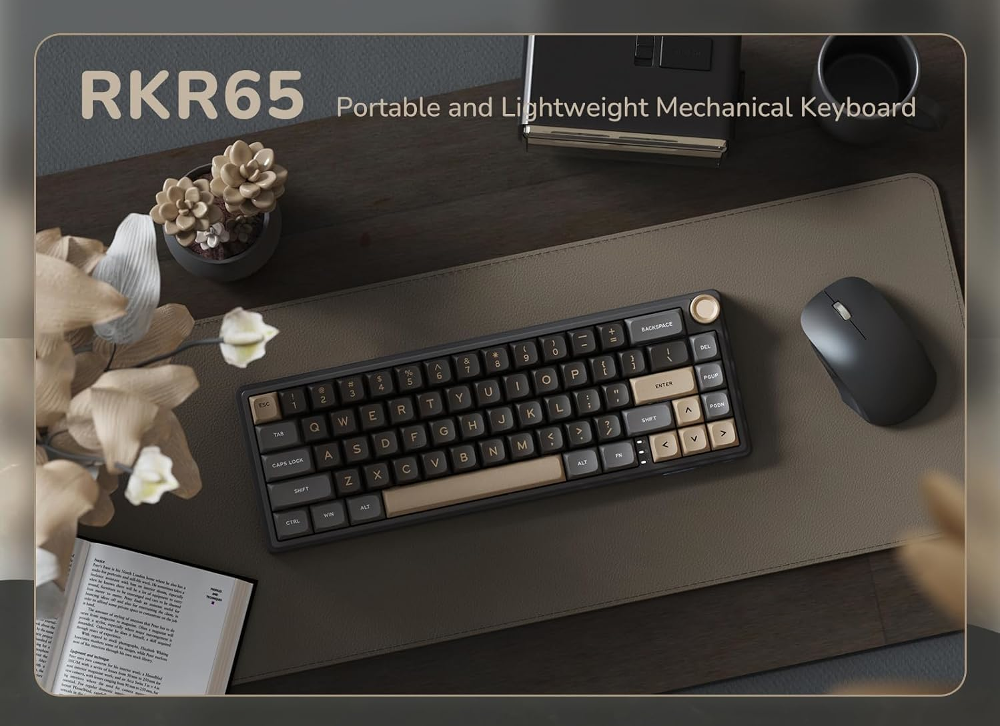

# Royal Kludge R65 firmware (Wired ISO version)



## Overview

The Royal Kludge R65 is a 66-key RGB backlit mechanical keyboard with Chartreuse, Brown, or Blue switches. It offers a gasket structure for a soft typing experience, knob volume adjustment, ergonomic design, hot-swappable keys and QMK support.

Briefly.
I just acquired this beauty from MercadoLibre.com.ar and sadly noticed RK no longer maintain a functional software, since @sdk66's BROKE MY KIBI I decided to remap both ISO and RGB matrix layout based on recent QMK documentation. 

This version relates to 342d:e480 device, most likely lastest Latinoamerican/International releases this year AFAIK.

This "batch" also seems not to support VIA, VIAL, SOCD, OpenRGB, SignalRGB, eruption (Linux), kanata (Linux), RK official software anymore, (although Chromium based browsers manage to detect it (Firefox needs WebHID extension installed) and ```WHATEVER_ENABLE = yes``` is set in rules.mk), IT JUST DOESN'T WORK! Please, read this [#issue](https://github.com/qmk/qmk_firmware/issues/24085).

*Major efforts are subject to keycode Deprecation Notices made by QMK as they mention on 11/2024 changelog, and RGB matrix layout fix to respective keys/values. You are always encouraged to visit [QKM Docs](https://docs.qmk.fm/) for further modding. Also you can always use this firmware as a rollback point, as long as it contains stock settings with funtional knob, state leds, Mac layout and all 43 defined RGB animations working properly.*

Special thanks to @sdk66 for sharing the initial firmware files and @irfanjmdn, @NieblaDev and @iamdanielv colaboration for fixing a major portion of the code. @qmk of course!

> [IMPORTANT] 
> This branch only contains files for the **wired ISO-layout** version of the Royal Kludge R65.
> **DO NOT** flash this firmware if your keyboard has wireless capabilities.
> **DO NOT** flash this firmware if you're unsure of what you're doing.

### > Setting Up Environment

1. **Install QMK MSYS**  
   Download and install [QMK MSYS](https://msys.qmk.fm).

2. **Configure QMK MSYS**  
   Open QMK MSYS and run the command:  
   ```bash
   qmk setup
   ```
   It may ask for confirmation and take a few minutes depending on network.
   A folder will be installed at `C:/Users/%USERNAME%/qmk_firmware`.

3. **Add Keyboard Files**  
   Download this repository and place the `rk/r65` folder into your `qmk_firmware/keyboards/` folder.

### > Compiling Firmware

1. **Compile the Firmware**  
   Run the following command in QMK MSYS:  
   ```bash
   qmk compile -j 0 -kb r65 -km iso
   ```
   *Note ```-j 0``` speeds up the job by enabling parallel threads.
   
2. **Locate the Firmware File**  
   Find the compiled `.bin` file in the root of the `qmk_firmware` folder.

### > Flashing Firmware

1. **Install QMK Toolbox**  
   Download and install [QMK Toolbox](https://github.com/qmk/qmk_toolbox/releases), portable EXE available.

2. **Load the Firmware File**  
   Open QMK Toolbox as Admin and load the `.bin` file.

3. **Enter Bootloader Mode**  
   Reset the keyboard into bootloader mode. (Procedure below)

4. **Flash the Firmware**  
   Click 'Flash', then 'Exit DFU' once the flashing process is complete.

### > Entering Bootloader/DFU Mode

- **Option 1**: Hold the Reset switch under space bar (find and find out) while connecting the USB cable.
- **Option 2**: Hold the Escape key while connecting the USB cable (this will also erase settings).
- **Option 3**: Press `Fn+Shift+Esc`. (Preferred)

## Known Issues

You tell me
