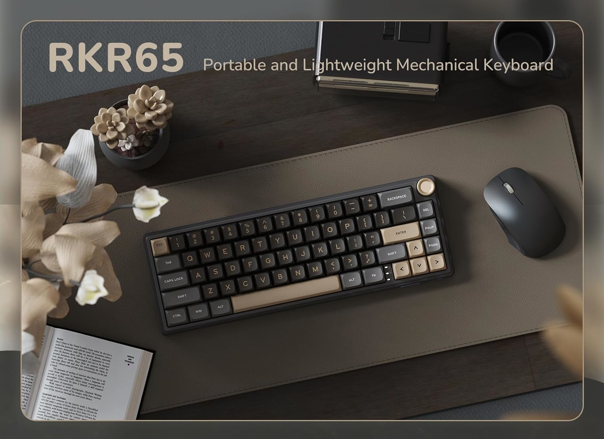

# Royal Kludge R65 firmware (Wired ISO version)

[](https://docs.qmk.fm/)
[](https://usevia.app/)

## Overview

The Royal Kludge R65 is a 66-key RGB backlit mechanical keyboard with hot-swappable switches, gasket mount, and knob volume control. This firmware targets the **wired ISO-layout** version (VID:PID `342d:e480`).



I acquired this from MercadoLibre.com.ar and noticed RK's official software is no longer maintained. Based on [@sdk66](https://github.com/sdk66)'s initial firmware, this remaps both the ISO layout and RGB matrix against recent QMK documentation.

Special thanks to [@sdk66](https://github.com/sdk66), [@NieblaDev](https://github.com/NieblaDev), and [@iamdanielv](https://github.com/iamdanielv) for the collaboration.

> **Important**
> This branch is for the **wired ISO** version only.
> Do **not** flash on wireless models or if unsure.

---

## Quick start

### Setting up

```bash
qmk setup
```

Place the `rk/r65` folder into `qmk_firmware/keyboards/`.

### Compile

```bash
qmk compile -j 0 -kb r65 -km iso
```

> `-j 0` enables parallel compilation threads.

### Flash

1. Open [QMK Toolbox](https://github.com/qmk/qmk_toolbox/releases) as Admin.
2. Load the compiled `.bin` file.
3. Enter bootloader mode (see below).
4. Click **Flash**, then **Exit DFU**.

### Enter bootloader mode

| Option | Method |
|--------|--------|
| **Preferred** | Press `Fn+Shift+Esc` |
| Reset switch | Hold the reset switch under the space bar while plugging in |
| Escape key | Hold `Esc` while plugging in (clears settings) |

---

## Features

- **Boot animation** — Rainbow sweep on startup.
- **VIA support** — Real-time keymapping via [usevia.app](https://usevia.app/).
- **43 RGB animations** — All built-in QMK effects + PaletteFx suite.
- **PaletteFx** — 16 palettes, 6 effects (Gradient renamed to Interference).
- **Mac layout** — Automatic Mac/Windows layer switching with status LED.
- **Knob** — Volume control with factory encoder map.
- **QMK bootloader** — `Fn+Shift+Esc` to enter flash mode.

> RGB matrix and keymap are adapted for QMK's 11/2024 keycode deprecation changes. Always check [QMK docs](https://docs.qmk.fm/) for the latest.

---

## Known issues

None yet. [Open an issue](../../issues) if you find one.
